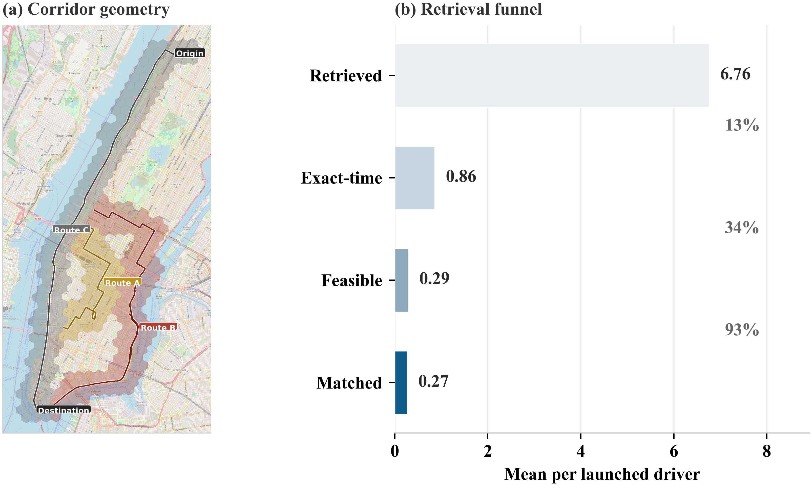
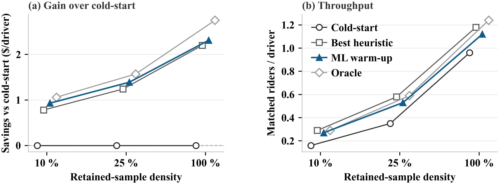

# Does Route Choice Matter in Ride-Pooling Dispatch?

This repository contains the public release for our study of route-aware ride-pooling on public NYC taxi data. The codebase includes the matching-ball retrieval engine, route-ranking models, the rolling-horizon dispatch workflow, checked-in result summaries, publication figures, and the manuscript package used for submission.

The central question is simple:

> If a platform evaluates a small set of genuine road-network alternatives before committing a driver to a route, does route choice materially change which riders are realistically matchable and what dispatch outcome the platform achieves?

<p align="center">
  
</p>

## Why This Repository Exists

Most ride-pooling pipelines treat route choice as a routing detail and study matching only after the default route has already been fixed. This repository studies a narrower but operationally meaningful alternative: route choice itself changes the candidate pool that the platform can see and serve.

The artifact is built around four methodological commitments:

- route alternatives must be genuine road-network alternatives rather than synthetic geometry perturbations
- retrieval speed and matching eligibility should be separated, so coarse index bins do not become the de facto matching rule
- route value should be tested both in isolated single-driver evaluation and in shared rolling dispatch
- public release assets should be strong enough for both paper review and repository-based inspection

In concrete terms, the system:

1. requests three OSRM alternatives for each driver origin-destination pair
2. converts each route into an H3 corridor through densification and one-ring expansion
3. retrieves riders through a corridor-aware spatiotemporal index
4. applies exact request-window, directionality, detour, and seat-capacity checks
5. ranks routes with heuristics or a learned profit predictor
6. validates those choices inside a 60-second rolling dispatch simulator with rider exclusivity

## What The Repository Contains

- a controlled single-driver route-choice study for mechanism isolation
- a rolling-horizon multi-driver dispatch study for system-level evidence
- checked-in summary tables for the paper’s headline claims
- publication-facing figures for GitHub and manuscript use
- a standalone IEEE-style manuscript package under `paper/`

This is intended to function as a public research release rather than only an internal experiment dump.

## Main Findings

The headline submission snapshot is summarized below.

| Setting | Cold-start | Best heuristic | ML warm-up | Oracle |
|---|---:|---:|---:|---:|
| Yellow primary dispatch loss / driver | `$8.08` | `$7.30` | `$7.15` | `$7.02` |
| Green primary dispatch loss / driver | `$7.66` | `$7.54` | `$7.27` | `$7.25` |
| Yellow isolated 10% single-driver loss | `$7.40` | `$6.28` | `$6.17` | `$5.95` |

These numbers support four main conclusions:

- route-aware dispatch materially improves on default cold-start routing
- the largest share of the gain comes from route-aware candidate construction and strong heuristics
- the learned scorer retains a smaller but consistent edge over the best heuristic
- exact request-window assumptions are methodologically important and materially affect the measured result

The paper’s intended claim is therefore not that ML dramatically dominates dispatch. The stronger claim is that route-aware retrieval changes the feasible rider set in the first place, and that this change survives into rolling dispatch outcomes under realistic timing rules.

## Visual Walkthrough

### 1. System framing

The architecture figure below shows the full pipeline from offline asset construction to online route scoring and dispatch evaluation.

<p align="center">
  
</p>

The important distinction is that H3 corridors and 15-minute bins are used to narrow the search, while exact eligibility is still enforced afterward on the true request timestamp and route-feasibility checks.

### 2. Mechanism

The matching-ball figure shows why route choice matters before dispatch policy even starts ranking drivers.

<p align="center">
  
</p>

This is the mechanism-level story of the repository:

- different routes create different corridors
- different corridors retrieve different rider pools
- only a subset of those riders survive exact-time and feasibility filters
- route value therefore depends on post-filter feasible opportunity, not raw spatial exposure

### 3. System-level outcome

The density-response figure is the clearest single system-level result for the landing page.

<p align="center">
  
</p>

Across retained-sample densities, route-aware policies consistently improve on cold-start. The strongest heuristic captures most of the gain, while ML warm-up preserves a smaller residual edge.

Additional figures, including the same-city Yellow--Green service-type comparison, model support, and sensitivity analysis, are kept in the manuscript package under `paper/figures/` and the checked-in plot directory under `results/plots/`.

## Repository Layout

- `src/`: matching, routing, simulation, dispatch, and model-training code
- `scripts/`: artifact runners, validators, summarizers, and analysis utilities
- `visualizations/`: figure-generation scripts
- `results/`: checked-in summary tables and GitHub-facing figures
- `paper/`: manuscript source and paper-only figure assets
- `tests/`: artifact and regression sanity checks
- `osrm/`: local OSRM setup helpers

Large raw and processed data products are intentionally not tracked in the public repository snapshot.

## Data Sources

The public release is built around openly available trip records and open routing/spatial tools:

- NYC TLC Yellow Taxi trip data
- NYC TLC Green Taxi trip data
- OSRM route alternatives
- H3 spatial indexing

The proxy design uses long taxi trips as driver surrogates and shorter trips as rider requests. Reported values are scenario-profit outputs under fixed assumptions rather than calibrated platform margins. The repository documents route-choice effects under a reproducible public benchmark; it is not intended as a claim of full production fleet realism.

## Quick Start

Install dependencies:

```powershell
python -m pip install -r requirements.txt
```

Run the full artifact:

```powershell
python run_all.py
```

Useful entry points:

```powershell
python run_all.py --single-driver-only
python run_all.py --dispatch-only --sample 1000 --seeds 3
python scripts\run_dispatch_artifact.py --sample 1000 --seeds 3 --primary-only
python visualizations\plot_paper_figures.py
python scripts\validate_paper_consistency.py
```

## Reproducibility

The detailed rebuild guide lives in [REPRODUCIBILITY.md](REPRODUCIBILITY.md).

Important checked-in outputs include:

- `results/dispatch_yellow_primary.csv`
- `results/dispatch_green_primary.csv`
- `results/domain_transfer_summary.csv`
- `results/dispatch_density_summary.csv`
- `results/dispatch_window_sensitivity.csv`
- `results/dispatch_detour_sensitivity.csv`
- `results/paper_primary_summary.csv`
- `results/model_comparison.csv`
- `results/strategy_gap_results.csv`
- `results/plots/paper_fig*.png`

## Manuscript Package

The paper source is in:

- `paper/ieee_submission.tex`
- `paper/references.bib`
- `paper/figures/`

The paper package notes are in [paper/README.md](paper/README.md). That package includes additional figure assets that are useful in the manuscript but not necessary on the GitHub landing page.

## Citation

If you use this repository, please cite the project metadata in [CITATION.cff](CITATION.cff) and reference the accompanying manuscript package under `paper/`.

## License

This repository is released under the [MIT License](LICENSE).
